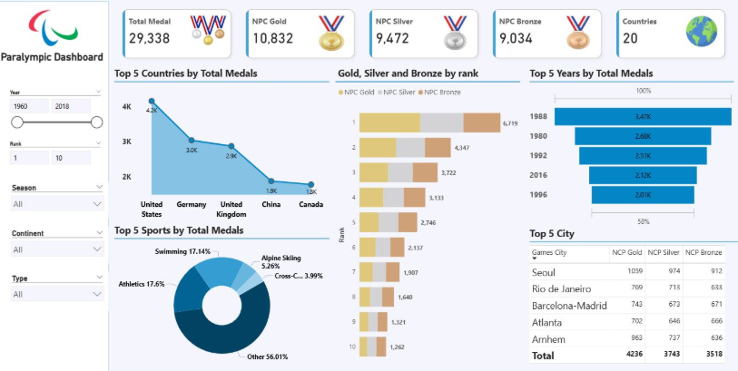

# Paralympic Games Medal Analysis Dashboard (Power BI)

## Project Overview
This project showcases an interactive Power BI dashboard built to analyze historical Paralympic Games medal data.
The dashboard highlights medal distribution trends across countries, years, sports, cities, and rankings,
helping users gain meaningful insights into performance patterns over time.

## Tools & Technologies
- Power BI
- DAX
- Power Query
- Data Modeling
- Data Cleaning & Transformation

## Dataset Information
The dataset contains historical Paralympic Games data, including:
- Participating countries (NPCs) and rankings
- Gold, Silver, and Bronze medal counts
- Games year and host cities
- Sports categories
- Season, continent, and game type details

## Analysis Covered
- **Overall Medal Performance**
  - Total medals along with gold, silver, and bronze counts
  - Total number of participating countries

- **Top Performing Countries**
  - Top 5 countries based on total medals
  - Comparison of medal contribution among leading nations

- **Rank-wise Medal Distribution**
  - Analysis of gold, silver, and bronze medals by NPC rank
  - Performance comparison across ranking positions

- **Year-wise Medal Trends**
  - Identification of top 5 Paralympic years based on total medals
  - Understanding growth and decline patterns over time

- **Sport-wise Medal Contribution**
  - Top sports contributing to total medals
  - Percentage share of each sport in overall medal count

- **City-wise Medal Analysis**
  - Top host cities based on medal distribution
  - Comparison of gold, silver, and bronze medals across cities

- **Interactive Filtering**
  - Filters by year range, rank, season, continent, and game type
  - Dynamic visuals responding to user selections

## Dashboard Preview

## Key Insights
- United States, Germany, and United Kingdom are among the top-performing countries in terms of total medals.
- Athletics and Swimming contribute the highest share of medals across Paralympic Games.
- Certain Paralympic years show noticeable spikes in medal distribution.
- Host cities play a significant role in overall medal counts.

## Project Purpose
This project demonstrates my ability to design interactive Power BI dashboards,
perform analytical storytelling, and present insights in a clear and decision-focused manner.
